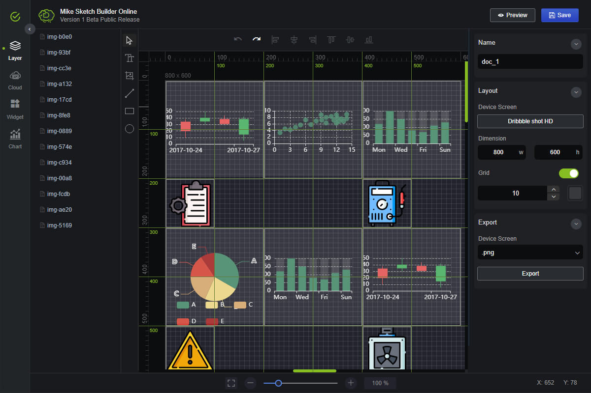

<a href="https://mike-zheng.github.io/sketch-builder" target="_blank" rel="noopener noreferrer">

</a>

  
   

**2021/07** https://mike-zheng.github.io/sketch-builder

## sketch-builder

Sketch-builder is a cloud web application that helps you create wireframes, mockups, diagrams and prototypes.

--------------------------------------

## Play Ground

https://mike-zheng.github.io/sketch-builder

## App Snapshot

